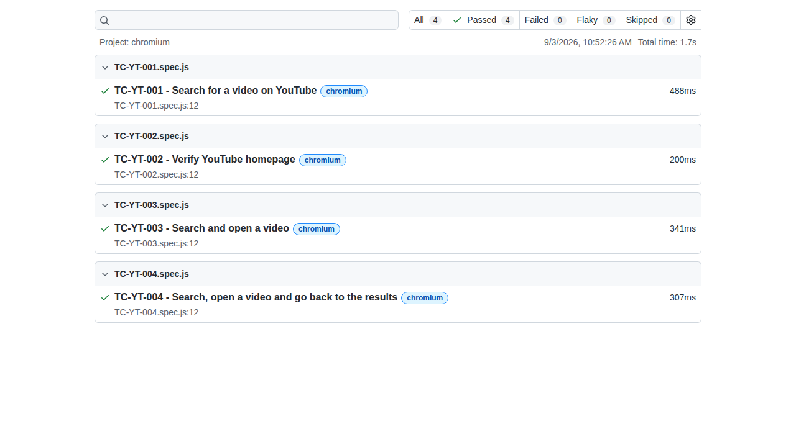

# Manual Test Case → Playwright Automation Generator

Turn a manual test case written in **Excel or Word** into an executable
**Playwright** test — parsed, understood, normalised, generated, executed and
reported, without anyone writing automation code.

```
Manual Test Case  →  Parse  →  Understand  →  Normalise  →  Generate  →  Execute  →  Report
   (.xlsx/.docx)                  (LLM)      (canonical)   (.spec.js)  (Playwright)  (HTML)
```

```console
$ npm run generate-and-test -- TC-YT-001

Reading test case TC-YT-001...
✓ XLSX parsed (input/youtube-tests.xlsx)
✓ Test case identified: TC-YT-001
✓ 6 manual steps detected in TC-YT-001

Analyzing steps... (analyzer: anthropic:claude-opus-5)
✓ Step 1 -> NAVIGATE  url = https://www.youtube.com
✓ Step 2 -> FILL  target = youtube.searchBox [role], value = Playwright automation
✓ Step 3 -> CLICK  target = youtube.searchButton [role]
✓ Step 4 -> ASSERT_VISIBLE  target = youtube.searchResults [css]
✓ Step 5 -> CLICK  target = youtube.firstSearchResult [css]
✓ Step 6 -> ASSERT_URL  value = /watch

Generating Playwright test...
✓ generated/TC-YT-001.spec.js

Executing test...
✓ TC-YT-001 passed

Report:
reports/html/index.html
```

---

## 1. Problem statement

Most QA teams already own hundreds of well written manual test cases in Excel
and Word. Automating them is a second, largely mechanical, translation job:
someone reads "Enter *Playwright automation* in the search box" and types
`page.getByRole('combobox', { name: /search/i }).fill('Playwright automation')`.

That translation has two halves with very different failure modes:

* **Understanding the sentence** is genuinely ambiguous work — a job an LLM is
  good at, and a job that has no single correct answer.
* **Producing correct, robust automation code** must be exact and repeatable —
  a job an LLM is bad at, and one that a template engine does perfectly.

This project splits the two apart. The model only ever produces a small,
schema-validated JSON object. A deterministic generator turns that object into
Playwright code. **The LLM never writes a line of the test.**

---

## 2. Architecture

```
                    ┌──────────────────────┐
                    │ Manual Test Case     │
                    │ Excel / Word         │
                    └──────────┬───────────┘
                               │
                               ▼
                    ┌──────────────────────┐
                    │ Document Parser      │   src/parser/
                    └──────────┬───────────┘
                               │  raw steps (free text)
                               ▼
                    ┌──────────────────────┐
                    │ Test Case Analyzer   │   src/analyzer/
                    │ LLM + Zod schema     │
                    └──────────┬───────────┘
                               │  structured JSON
                               ▼
                    ┌──────────────────────┐
                    │ Canonical Test Model │   src/model/
                    │ validated, typed     │
                    └──────────┬───────────┘
                               │
                               ▼
                    ┌──────────────────────┐
                    │ Playwright Generator │   src/generator/
                    │ deterministic        │
                    └──────────┬───────────┘
                               │
                               ▼
                    ┌──────────────────────┐
                    │ Generated Test       │   generated/*.spec.js
                    │ *.spec.js            │
                    └──────────┬───────────┘
                               │
                               ▼
                    ┌──────────────────────┐
                    │ Playwright Runner    │   src/executor/
                    └──────────┬───────────┘
                               │
                               ▼
                    ┌──────────────────────┐
                    │ HTML Test Report     │   reports/html/
                    └──────────────────────┘
```

### The design principle

| AI responsibility | Framework responsibility |
| --- | --- |
| Understand human language | Validate the schema |
| Identify intent | Resolve the selector strategy |
| Identify the action | Generate Playwright code |
| Identify the target | Execute the test |
| Identify value / expected result | Produce the report |

Everything on the left is probabilistic and reviewable as JSON. Everything on
the right is deterministic: the same canonical test case always produces
byte-identical code, so generated specs diff cleanly in version control.

---

## 3. Technology stack

| Concern | Choice |
| --- | --- |
| Runtime | Node.js 18+, JavaScript (ES modules) |
| Browser automation | Playwright (`@playwright/test`) |
| Excel parsing | ExcelJS |
| Word parsing | Mammoth |
| Schema validation | Zod |
| Language understanding | Anthropic Messages API (`claude-opus-5`) with structured outputs |
| Reporting | Playwright HTML reporter |
| Framework unit tests | `node:test` |

---

## 4. Project layout

```
playwright-test-generator/
├── src/
│   ├── parser/
│   │   ├── excelParser.js        # .xlsx → raw test cases
│   │   ├── wordParser.js         # .docx → raw test cases
│   │   └── index.js              # format dispatch + test case selection
│   ├── analyzer/
│   │   ├── testCaseAnalyzer.js   # orchestration + Zod validation
│   │   ├── llmProvider.js        # Anthropic structured-output interpreter
│   │   ├── heuristicProvider.js  # offline rule-based interpreter
│   │   └── prompt.js             # system prompt + per-step prompt
│   ├── model/
│   │   └── testCaseSchema.js     # the canonical model (single source of truth)
│   ├── generator/
│   │   ├── playwrightGenerator.js# canonical model → .spec.js
│   │   └── selectorStrategy.js   # selector priority + application catalog
│   ├── executor/
│   │   └── testExecutor.js       # runs Playwright, returns the exit code
│   ├── util/logger.js
│   └── cli.js
├── input/
│   ├── youtube-tests.xlsx        # sample manual test cases
│   └── youtube-tests.docx
├── generated/                    # generated specs (committed, never hand edited)
├── tests/                        # unit tests for the framework itself
├── mock/server.js                # offline stand-in for youtube.com
├── scripts/build-input-files.js  # regenerates the sample documents
├── reports/                      # Playwright HTML report + traces
├── playwright.config.js
└── package.json
```

---

## 5. Installation

```bash
git clone https://github.com/PriyadharsiniRK/Practice-Playwright-with-JS.git
cd Practice-Playwright-with-JS

npm install
npx playwright install chromium

# Optional - enables the LLM analyzer. Without it the offline analyzer is used.
cp .env.example .env   # then set ANTHROPIC_API_KEY
```

Try it immediately, no API key and no internet required:

```bash
npm run demo
```

---

## 6. Input format

### Excel

One header row, then **one row per manual step**. Rows sharing a `TestCaseID`
are grouped into a single test case, in sheet order. Only the first worksheet
is read.

| TestCaseID | Title | Preconditions | Step | ExpectedResult |
| --- | --- | --- | --- | --- |
| TC-YT-001 | Search YouTube | Internet available | Open https://www.youtube.com | YouTube homepage displayed |
| TC-YT-001 | Search YouTube | Internet available | Enter "Playwright automation" in the search box | Search text entered |
| TC-YT-001 | Search YouTube | Internet available | Click the Search button | Search results displayed |
| TC-YT-001 | Search YouTube | Internet available | Click the first search result | Video page displayed |

`TestCaseID`, `Title` and `Step` are required; `Preconditions` and
`ExpectedResult` are optional. Column headers are matched case- and
spacing-insensitively, and a few aliases are accepted (`ID`, `Action`,
`Expected`, …).

### Word

One block per test case:

```
Test Case ID: TC-YT-001
Title: Search for a video on YouTube
Precondition: User has internet access.
Steps:
1. Open https://www.youtube.com
Expected: YouTube homepage is displayed
2. Enter "Playwright automation" in the search box
3. Click the Search button
```

`Expected:` lines attach to the step above them. Any line that does not match
one of these prefixes is ignored, so headings and blank lines are harmless.

Both sample documents are committed under `input/` and can be regenerated with
`npm run build:inputs`.

> Supporting arbitrary spreadsheet and document layouts is an explicit
> non-goal. The formats above are the contract.

---

## 7. Canonical test model

```js
Action =
  | 'NAVIGATE' | 'GO_BACK' | 'CLICK' | 'FILL' | 'PRESS'
  | 'ASSERT_VISIBLE' | 'ASSERT_TEXT' | 'ASSERT_URL' | 'ASSERT_TITLE'

TestStep {
  stepNumber: number
  originalText: string        // the manual sentence, kept for traceability
  action: Action
  target?: {
    description: string       // "YouTube search box"
    role?: string             // "combobox"
    name?: string             // "Search"
    locator?: string          // author escape hatch, lowest priority
  }
  value?: string
  expected?: string
}

TestCase {
  id: string
  title: string
  preconditions?: string[]
  steps: TestStep[]
}
```

Defined in `src/model/testCaseSchema.js` as Zod schemas. Nothing downstream of
this model ever sees free text it has to interpret.

`npm run analyze -- TC-YT-001` prints the canonical model, which is the most
useful thing to look at when a generated test is not what you expected.

---

## 8. Test case understanding

The analyzer asks the model about **one step at a time**, with the rest of the
test case supplied only as context. It requests a fixed JSON shape via the
Messages API's structured outputs, so the response is schema-constrained at
decode time:

```
Test Case:
Search for a video on YouTube

Step:
2. Enter "Playwright automation" in the search box
```

```json
{
  "stepNumber": 2,
  "originalText": "Enter \"Playwright automation\" in the search box",
  "action": "FILL",
  "target": { "description": "YouTube search box", "role": "combobox", "name": "Search" },
  "value": "Playwright automation"
}
```

The response is then validated with Zod on our side as well. If validation
fails, the analyzer makes **one controlled repair attempt**, handing the model
the validation error, and re-validates. A second failure raises
`INVALID_LLM_RESPONSE` with the offending payload rather than guessing.

### Two analyzers, one contract

| Provider | Used when | Notes |
| --- | --- | --- |
| `anthropic:claude-opus-5` | `ANTHROPIC_API_KEY` is set | Handles free-form wording |
| `heuristic` | no key, or `--provider heuristic` | Deterministic rules, no network, no spend |

Both emit the identical structure and pass through the identical validation, so
every later stage is unchanged. The provider in use is printed by the CLI and
recorded in the header of every generated spec — the framework never silently
swaps one for the other.

---

## 9. Selector strategy

The model is explicitly forbidden from producing selectors. It describes the
element; the framework decides how to find it, in this priority order:

```
1. getByRole()          ← preferred
2. getByLabel()
3. getByPlaceholder()
4. getByText()
5. locator()            ← CSS, last resort
```

Resolution happens in `src/generator/selectorStrategy.js`:

1. **Application catalog** — well-known elements of the app under test are
   pinned to a curated locator. When several entries match, the most specific
   wording wins (`first search result` beats `search results`); a genuine tie
   raises `AMBIGUOUS_TARGET`.
2. **Analyzer role + name** — `getByRole(role, { name })` for anything not in
   the catalog.
3. **Author-supplied `locator`** — the deliberate escape hatch.
4. Otherwise `TARGET_NOT_UNDERSTOOD`, listing the elements it does know.

So this:

```js
page.getByRole('button', { name: /search/i })
```

is always preferred over this:

```js
page.locator('#some-random-id')
```

---

## 10. Example: manual test in, Playwright test out

**Manual test case (Excel row group)**

```
Test Case ID: TC-YT-001
Title:        Search for a video on YouTube
Precondition: User has internet access.

1. Open https://www.youtube.com
2. Enter "Playwright automation" in the search box
3. Click the Search button
4. Verify that search results are displayed
5. Click the first search result
6. Verify that the video page is displayed
```

**Normalised steps**

```
1. NAVIGATE        url = https://www.youtube.com
2. FILL            target = search input, value = Playwright automation
3. CLICK           target = Search button
4. ASSERT_VISIBLE  target = search results
5. CLICK           target = first search result
6. ASSERT_URL      expected = /watch
```

**Generated `generated/TC-YT-001.spec.js`**

```js
// ---------------------------------------------------------------------------
// GENERATED FILE - do not edit by hand.
// Produced by playwright-test-generator from a manual test case.
//   test case : TC-YT-001
//   source    : input/youtube-tests.xlsx
//   analyzer  : heuristic
// Re-run `npm run generate` after editing the manual test case.
// ---------------------------------------------------------------------------

import { test, expect } from '@playwright/test';

test('TC-YT-001 - Search for a video on YouTube', async ({ page }) => {
  // Precondition: User has internet access.

  // Step 1: Open https://www.youtube.com
  await page.goto('https://www.youtube.com');

  // Step 2: Enter "Playwright automation" in the search box
  await page.getByRole('combobox', { name: /search/i }).fill('Playwright automation');

  // Step 3: Click the Search button
  await page.getByRole('button', { name: /^search$/i }).click();

  // Step 4: Verify that search results are displayed
  await expect(page.locator('ytd-search')).toBeVisible();

  // Step 5: Click the first search result
  await page.locator('ytd-video-renderer').first().click();

  // Step 6: Verify that the video page is displayed
  await expect(page).toHaveURL(/\/watch/i);
});
```

Each generated statement carries the manual sentence it came from, so a
failing line in CI points straight back at a line in the manual test case.

> The committed specs were generated with the offline analyzer, which is why
> their header reads `heuristic`. Regenerating with `ANTHROPIC_API_KEY` set
> produces the same code with `anthropic:claude-opus-5` in the header.

---

## 11. Commands

```bash
npm run parse             -- TC-YT-001     # document → raw steps (JSON)
npm run analyze           -- TC-YT-001     # raw steps → canonical model (JSON)
npm run generate          -- TC-YT-001     # canonical model → generated/*.spec.js
npm test                                   # run every generated spec
npm run generate-and-test -- TC-YT-001     # the whole pipeline
npm run report                             # open the HTML report
npm run demo                               # full pipeline, offline
npm run test:unit                          # unit tests for the framework
npm run build:inputs                       # regenerate the sample documents
```

Omit the test case id to process every test case in the document.

| Option | Meaning |
| --- | --- |
| `-i, --input <file>` | manual test case document (default `input/youtube-tests.xlsx`) |
| `-o, --out <dir>` | where to write generated specs (default `generated/`) |
| `-p, --provider <mode>` | `auto` (default), `llm`, or `heuristic` |
| `--offline` | generate and run against the bundled local stand-in |
| `--headed` | run the browser headed |

### Reading the Word document instead

```bash
npm run generate-and-test -- TC-YT-003 --input input/youtube-tests.docx
```

---

## 12. Adding a new test case — the point of the whole thing

Add rows to the spreadsheet. That is the entire workflow.

| TestCaseID | Title | Preconditions | Step | ExpectedResult |
| --- | --- | --- | --- | --- |
| TC-YT-005 | Search using the keyboard only | Internet available | Open https://www.youtube.com | Homepage shown |
| TC-YT-005 | Search using the keyboard only | Internet available | Enter "Playwright trace viewer" in the search box | Text entered |
| TC-YT-005 | Search using the keyboard only | Internet available | Press Enter | Search submitted |
| TC-YT-005 | Search using the keyboard only | Internet available | Verify that search results are displayed | Results shown |
| TC-YT-005 | Search using the keyboard only | Internet available | Verify that the page title contains "Playwright" | Tab shows the query |

```bash
npm run generate-and-test -- TC-YT-005
```

```
✓ Step 1 -> NAVIGATE  url = https://www.youtube.com
✓ Step 2 -> FILL  target = youtube.searchBox [role], value = Playwright trace viewer
✓ Step 3 -> PRESS  value = Enter
✓ Step 4 -> ASSERT_VISIBLE  target = youtube.searchResults [css]
✓ Step 5 -> ASSERT_TITLE  value = Playwright
✓ generated/TC-YT-005.spec.js
✓ TC-YT-005 passed
```

**No framework file was edited.** A new UI element that the catalog has never
seen is a one-line data entry in `TARGET_CATALOG`; a new test case over
existing elements needs nothing at all.

---

## 13. Error handling

The pipeline refuses to produce automation it cannot stand behind. Every
failure carries a stable code and a non-zero exit status.

| Code | Raised when |
| --- | --- |
| `INVALID_TEST_CASE` | the document is malformed, or the requested id does not exist |
| `UNSUPPORTED_ACTION` | a step cannot be expressed with the supported actions |
| `TARGET_NOT_UNDERSTOOD` | no locator can be resolved for the element |
| `AMBIGUOUS_TARGET` | the description matches several known elements equally well |
| `INVALID_LLM_RESPONSE` | the model's output fails schema validation twice |
| `GENERATION_FAILED` | the canonical model is internally inconsistent |
| `TEST_EXECUTION_FAILED` | Playwright could not be started |

```console
$ npm run generate -- TC-YT-099

✓ Step 1 -> NAVIGATE  url = https://www.youtube.com

✗ UNSUPPORTED_ACTION: Unsupported assertion.

Step 2:
"Verify that recommended videos are relevant"

The framework currently supports:
- visible
- text
- URL
- title
```

```console
✗ TARGET_NOT_UNDERSTOOD: Could not resolve a locator for "subscribe button".

Known elements for this application:
- YouTube search box
- YouTube search button
- YouTube search results list
- first YouTube search result
- YouTube video player
- YouTube logo
- video title heading on the watch page

Reword the manual step to refer to one of them, or add the element to
TARGET_CATALOG in src/generator/selectorStrategy.js.
```

A half-understood step never becomes a half-correct test.

---

## 14. Test report

`npm test` writes a Playwright HTML report to `reports/html/`; open it with
`npm run report`.



Traces, screenshots and video are retained on failure under
`reports/artifacts/`, so a failed generated test is debuggable exactly like a
hand-written one.

---

## 15. Offline mode

`--offline` points the generated tests at `mock/server.js`, a ~130-line stand-in
that reproduces only the accessibility hooks the tests use — the "Search"
combobox and button, `ytd-search`, `ytd-video-renderer`, the "YouTube Home"
logo link and `#movie_player`.

It exists so the whole pipeline can be demonstrated and run in CI without
depending on youtube.com being reachable, and without a test suite repeatedly
hitting a third-party site. **Only the origin in `page.goto()` differs** — every
selector, action and assertion in the generated code is identical to the code
that runs against the real site.

---

## 16. Design decisions

* **The LLM never emits code.** It fills in a small JSON object; a template
  engine produces the Playwright source. This is the single decision the whole
  project is built around — it makes output reviewable, diffable and
  reproducible, and it caps the blast radius of a bad model response at "one
  step was misclassified" rather than "the test does something unexpected".
* **A canonical model in the middle.** Parsers, analyzers and generators only
  ever talk to `TestCase`. Adding a PDF parser or a Cypress generator means
  writing one module, not touching the pipeline.
* **Zod at every boundary**, including between our own stages. A schema error
  points at a field, not at a stack trace.
* **Selectors are framework property, not model output.** The catalog plus a
  role/name fallback keeps generated tests readable and robust, and makes a
  brittle selector a one-line fix in one place rather than a find-and-replace
  across generated files.
* **One step per model call.** Smaller prompts, cheaper repairs, and a failure
  isolated to the step that caused it.
* **The offline analyzer is a peer, not a silent fallback.** It always announces
  itself and is recorded in the generated file header.
* **Generated specs are committed.** The diff of a regenerated suite is the
  clearest possible review of a change to a manual test case.

---

## 17. Limitations

* Scope is a deliberately small slice of YouTube: open, search, verify results,
  open a video, verify URL/title/visibility, navigate back.
* Nine canonical actions and four assertion kinds. Anything else is refused
  rather than approximated.
* One header-row Excel layout and one Word layout. No merged cells, no
  multi-sheet workbooks, no tables inside Word.
* Elements outside `TARGET_CATALOG` rely on the analyzer inferring a usable
  role and accessible name.
* Steps are interpreted independently; there is no cross-step state beyond the
  test case title supplied as context.
* Against the live site, YouTube's consent dialogs, A/B tested markup and
  locale differences can affect the curated selectors — the offline mode exists
  partly because of this.
* No login, no cookies, no test data management.

---

## 18. Future enhancements

Not implemented, and deliberately so:

* Jira / Xray and Azure DevOps integration
* PDF test cases
* Requirement-to-test generation
* Automatic locator discovery and self-healing selectors
* Test data generation
* Combined API + UI tests
* Test case deduplication and coverage analysis
* Page Object Model generation
* CI/CD integration and a test execution dashboard
* Multiple applications / domains in one catalog
* Human approval gate before generated tests are executed

---

## 19. Licence

MIT — see [LICENSE](LICENSE).
