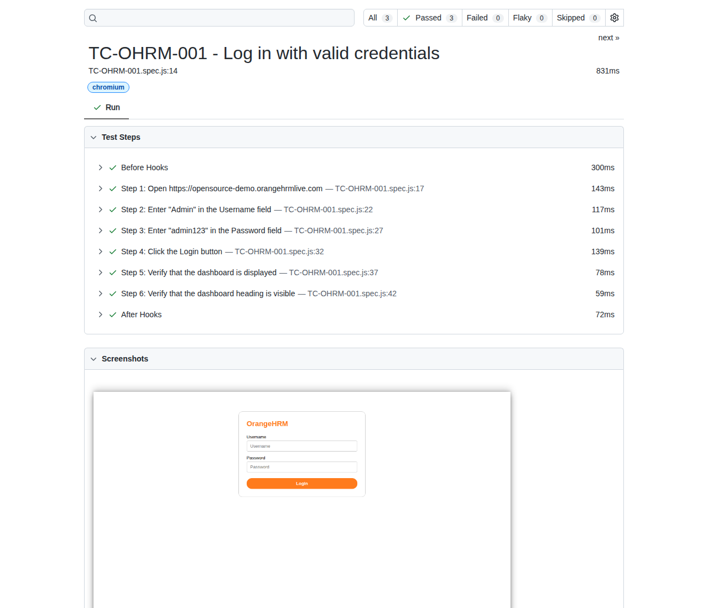

# Manual Test Case → Playwright Automation Generator

An AI-assisted test automation framework that turns a manual test case written
in **Excel or Word** into an executable **Playwright** test. It parses,
understands, normalises, generates, executes and reports, and nobody writes
automation code by hand.

## 1. Project overview

The demo application is **YouTube**: search for a video, verify the results,
open a video, verify the page. The same pipeline also drives four more sites
(OrangeHRM, SauceDemo, car.info and TNEB); see
[docs/applications.md](docs/applications.md).

```
Manual Test Case  →  Parse  →  Understand  →  Normalise  →  Generate  →  Execute  →  Report
   (.xlsx/.docx)                  (LLM)      (canonical)   (.spec.js)  (Playwright)  (HTML)
```

What it demonstrates:

1. Reading manual test cases from Excel and from Word.
2. Understanding the intent of each step (LLM, or rule-based without an API key).
3. Normalising each step into a strictly typed, Zod-validated model.
4. Mapping that model to Playwright actions with a deterministic generator.
5. Running the generated tests against the **real site** and producing an
   HTML report.
6. Adding a **new** manual test case without changing any framework code.

---

## 2. Problem statement

Most QA teams already own hundreds of well written manual test cases in Excel
and Word. Automating them is a second, largely mechanical, translation job:
someone reads "Enter *Playwright automation* in the search box" and types
`page.getByRole('combobox', { name: /search/i }).fill('Playwright automation')`.

That translation has two halves with very different failure modes:

* **Understanding the sentence** is genuinely ambiguous work — a job an LLM is
  good at, and a job that has no single correct answer.
* **Producing correct, robust automation code** must be exact and repeatable —
  a job an LLM is bad at, and one that a template engine does perfectly.

This project splits the two apart. The model only ever produces a small,
schema-validated JSON object. A deterministic generator turns that object into
Playwright code. **The LLM never writes a line of the test.**

---

## 3. Architecture

```
                    ┌──────────────────────┐
                    │ Manual Test Case     │
                    │ Excel / Word         │
                    └──────────┬───────────┘
                               │
                               ▼
                    ┌──────────────────────┐
                    │ Document Parser      │   src/parser/
                    └──────────┬───────────┘
                               │  raw steps (free text)
                               ▼
                    ┌──────────────────────┐
                    │ Test Case Analyzer   │   src/analyzer/
                    │ LLM + Zod schema     │
                    └──────────┬───────────┘
                               │  structured JSON
                               ▼
                    ┌──────────────────────┐
                    │ Canonical Test Model │   src/model/
                    │ validated, typed     │
                    └──────────┬───────────┘
                               │
                               ▼
                    ┌──────────────────────┐
                    │ Playwright Generator │   src/generator/
                    │ deterministic        │
                    └──────────┬───────────┘
                               │
                               ▼
                    ┌──────────────────────┐
                    │ Generated Test       │   generated/*.spec.js
                    │ *.spec.js            │
                    └──────────┬───────────┘
                               │
                               ▼
                    ┌──────────────────────┐
                    │ Playwright Runner    │   src/executor/
                    └──────────┬───────────┘
                               │
                               ▼
                    ┌──────────────────────┐
                    │ HTML Test Report     │   reports/
                    └──────────────────────┘
```

### The design principle: AI vs framework responsibility

| AI responsibility | Framework responsibility |
| --- | --- |
| Understand human language | Validate the schema |
| Identify intent | Resolve the selector strategy |
| Identify the action | Generate Playwright code |
| Identify the target | Execute the test |
| Identify value / expected result | Produce the report |

Everything on the left is probabilistic and reviewable as JSON. Everything on
the right is deterministic: the same canonical test case always produces
byte-identical code, so generated specs diff cleanly in version control.

---

## 4. Technology stack

| Concern | Choice |
| --- | --- |
| Runtime | Node.js 18+, JavaScript (ES modules) |
| Browser automation | Playwright (`@playwright/test`) |
| Excel parsing | ExcelJS |
| Word parsing | Mammoth |
| Schema validation | Zod |
| Language understanding | Anthropic Messages API (`claude-opus-5`) with structured outputs |
| Reporting | Playwright HTML reporter |
| Framework unit tests | `node:test` |

### Project layout

```
playwright-test-generator/
├── src/
│   ├── parser/
│   │   ├── excelParser.js        # .xlsx → raw test cases
│   │   ├── wordParser.js         # .docx → raw test cases
│   │   └── index.js              # format dispatch + test case selection
│   ├── analyzer/
│   │   ├── testCaseAnalyzer.js   # orchestration + Zod validation
│   │   ├── llmProvider.js        # Anthropic structured-output interpreter
│   │   ├── heuristicProvider.js  # rule-based interpreter (no API key)
│   │   └── prompt.js             # system prompt + per-step prompt
│   ├── model/
│   │   └── testCaseSchema.js     # the canonical model (single source of truth)
│   ├── generator/
│   │   ├── playwrightGenerator.js# canonical model → .spec.js
│   │   ├── selectorStrategy.js   # selector priority, application-scoped
│   │   └── applications/         # one file per app under test
│   │       ├── index.js          #   registry + hostname resolution
│   │       ├── youtube.js
│   │       ├── orangehrm.js
│   │       ├── saucedemo.js
│   │       ├── carinfo.js
│   │       └── tneb.js
│   ├── executor/
│   │   └── testExecutor.js       # runs Playwright, returns the exit code
│   ├── report/stepReporter.js    # step-by-step HTML report
│   ├── util/logger.js
│   └── cli.js
├── input/
│   ├── youtube-tests.xlsx        # sample manual test cases
│   ├── youtube-tests.docx
│   └── ...                       # other applications (docs/applications.md)
├── generated/                    # generated specs (committed, never hand edited)
├── tests/                        # unit tests for the framework itself
├── scripts/                      # sample-document builders, `npm run names`
├── docs/                         # per-application notes, report screenshot
├── reports/                      # HTML report (reports/index.html)
├── playwright.config.js
└── package.json
```

---

## 5. Input format

### Excel

One header row, then **one row per manual step**. Rows sharing a `TestCaseID`
are grouped into a single test case, in sheet order. Only the first worksheet
is read.

| TestCaseID | Title | Preconditions | Step | ExpectedResult |
| --- | --- | --- | --- | --- |
| TC-YT-001 | Search YouTube | Internet available | Open https://www.youtube.com | YouTube homepage displayed |
| TC-YT-001 | Search YouTube | Internet available | Enter "Playwright automation" in the search box | Search text entered |
| TC-YT-001 | Search YouTube | Internet available | Click the Search button | Search results displayed |
| TC-YT-001 | Search YouTube | Internet available | Click the first search result | Video page displayed |

`TestCaseID`, `Title` and `Step` are required; `Preconditions` and
`ExpectedResult` are optional. Column headers are matched case- and
spacing-insensitively, and a few aliases are accepted (`ID`, `Action`,
`Expected`, …).

### Word

One block per test case:

```
Test Case ID: TC-YT-001
Title: Search for a video on YouTube
Precondition: User has internet access.
Steps:
1. Open https://www.youtube.com
Expected: YouTube homepage is displayed
2. Enter "Playwright automation" in the search box
3. Click the Search button
```

`Expected:` lines attach to the step above them. Any line that does not match
one of these prefixes is ignored, so headings and blank lines are harmless.

Both sample documents are committed under `input/` and can be regenerated with
`npm run build:inputs`.

> Supporting arbitrary spreadsheet and document layouts is an explicit
> non-goal. The formats above are the contract.

---

## 6. Canonical test model

```js
Action =
  | 'NAVIGATE' | 'GO_BACK' | 'GO_FORWARD' | 'CLICK' | 'FILL' | 'CLEAR' | 'PRESS' | 'SELECT'
  | 'ASSERT_VISIBLE' | 'ASSERT_HIDDEN' | 'ASSERT_TEXT' | 'ASSERT_URL' | 'ASSERT_TITLE'

TestStep {
  stepNumber: number
  originalText: string        // the manual sentence, kept for traceability
  action: Action
  target?: {
    description: string       // "YouTube search box"
    role?: string             // "combobox"
    name?: string             // "Search"
    locator?: string          // author escape hatch, lowest priority
  }
  value?: string
  expected?: string
}

TestCase {
  id: string
  title: string
  preconditions?: string[]
  steps: TestStep[]
}
```

Defined in `src/model/testCaseSchema.js` as Zod schemas. Nothing downstream of
this model ever sees free text it has to interpret.

`npm run analyze -- TC-YT-001` prints the canonical model, which is the most
useful thing to look at when a generated test is not what you expected.

### Test case understanding

The analyzer asks the model about **one step at a time**, with the rest of the
test case supplied only as context. It requests a fixed JSON shape via the
Messages API's structured outputs, so the response is schema-constrained at
decode time:

```
Test Case:
Search for a video on YouTube

Step:
2. Enter "Playwright automation" in the search box
```

```json
{
  "stepNumber": 2,
  "originalText": "Enter \"Playwright automation\" in the search box",
  "action": "FILL",
  "target": { "description": "YouTube search box", "role": "combobox", "name": "Search" },
  "value": "Playwright automation"
}
```

The response is then validated with Zod on our side as well. If validation
fails, the analyzer makes **one controlled repair attempt**, handing the model
the validation error, and re-validates. A second failure raises
`INVALID_LLM_RESPONSE` with the offending payload rather than guessing.

#### Two analyzers, one contract

| Provider | Used when | Notes |
| --- | --- | --- |
| `anthropic:claude-opus-5` | `ANTHROPIC_API_KEY` is set | Handles free-form wording |
| `heuristic` | no key, or `--provider heuristic` | Deterministic rules, no network, no spend |

Both emit the identical structure and pass through the identical validation, so
every later stage is unchanged. The provider in use is printed by the CLI and
recorded in the header of every generated spec — the framework never silently
swaps one for the other.

### Selector strategy

The model is explicitly forbidden from producing selectors. It describes the
element; the framework decides how to find it, in this priority order:

```
1. getByRole()          ← preferred
2. getByLabel()
3. getByPlaceholder()
4. getByText()
5. locator()            ← CSS, last resort
```

Each test case is bound to **one application**, chosen from the hostname of its
first navigation step. That keeps element vocabularies from colliding: "search
box" means YouTube's masthead combobox in one test case and OrangeHRM's sidebar
filter in another, and the framework never has to guess which.

Resolution happens in `src/generator/selectorStrategy.js`:

1. **Application catalog** — well-known elements of the app under test are
   pinned to a curated locator. When several entries match, the most specific
   wording wins (`first search result` beats `search results`); a genuine tie
   raises `AMBIGUOUS_TARGET`.
2. **Analyzer role + name** — `getByRole(role, { name })` for anything not in
   the catalog.
3. **Author-supplied `locator`** — the deliberate escape hatch.
4. Otherwise `TARGET_NOT_UNDERSTOOD`, listing the elements it does know.

So this:

```js
page.getByRole('button', { name: /search/i })
```

is always preferred over this:

```js
page.locator('#some-random-id')
```

---

## 7. Example manual test

**Manual test case** (`input/youtube-tests.xlsx`, also in `input/youtube-tests.docx`)

```
Test Case ID: TC-YT-001
Title:        Search for a video on YouTube
Precondition: User has internet access.

1. Open https://www.youtube.com
2. Enter "Playwright automation" in the search box
3. Click the Search button
4. Verify that search results are displayed
5. Click the first search result
6. Verify that the video page is displayed
```

**Normalised steps** (`npm run analyze -- TC-YT-001`)

```
1. NAVIGATE        url = https://www.youtube.com
2. FILL            target = search input, value = Playwright automation
3. CLICK           target = Search button
4. ASSERT_VISIBLE  target = search results
5. CLICK           target = first search result
6. ASSERT_URL      expected = /watch
```

---

## 8. Generated Playwright test

`generated/TC-YT-001.spec.js`, produced by the deterministic generator:

```js
// ---------------------------------------------------------------------------
// GENERATED FILE - do not edit by hand.
// Produced by playwright-test-generator from a manual test case.
//   test case : TC-YT-001
//   application: YouTube
//   source    : input/youtube-tests.xlsx
//   analyzer  : heuristic
//   screenshots: one per step
// Re-run `npm run generate` after editing the manual test case.
// ---------------------------------------------------------------------------

import { test, expect } from '@playwright/test';

test('TC-YT-001 - Search for a video on YouTube', async ({ page }, testInfo) => {
  // Precondition: User has internet access.

  await test.step('Step 1: Open https://www.youtube.com', async () => {
    await page.goto('https://www.youtube.com');
    await testInfo.attach('Step 1', { body: await page.screenshot(), contentType: 'image/png' });
  });

  await test.step('Step 2: Enter "Playwright automation" in the search box', async () => {
    await page.getByRole('combobox', { name: /search/i }).fill('Playwright automation');
    await testInfo.attach('Step 2', { body: await page.screenshot(), contentType: 'image/png' });
  });

  await test.step('Step 3: Click the Search button', async () => {
    await page.getByRole('button', { name: /^search$/i }).click();
    await testInfo.attach('Step 3', { body: await page.screenshot(), contentType: 'image/png' });
  });

  await test.step('Step 4: Verify that search results are displayed', async () => {
    await expect(page.locator('ytd-search')).toBeVisible();
    await testInfo.attach('Step 4', { body: await page.screenshot(), contentType: 'image/png' });
  });

  await test.step('Step 5: Click the first search result', async () => {
    await page.locator('ytd-video-renderer').first().click();
    await testInfo.attach('Step 5', { body: await page.screenshot(), contentType: 'image/png' });
  });

  await test.step('Step 6: Verify that the video page is displayed', async () => {
    await expect(page).toHaveURL(/\/watch/i);
    await testInfo.attach('Step 6', { body: await page.screenshot(), contentType: 'image/png' });
  });
});
```

Each manual sentence becomes the name of a `test.step()`, so it appears word
for word in the report and the trace. A failing step points straight back at a
line in the manual test case. Each step also attaches a screenshot. Generate
with `--no-screenshots` to leave them out and get only the Playwright
statements.

> The committed specs were generated with the rule-based analyzer, which is why
> their header reads `heuristic`. Regenerating with `ANTHROPIC_API_KEY` set
> produces the same code with `anthropic:claude-opus-5` in the header.

---

## 9. Execution example

```console
$ npm run generate-and-test -- TC-YT-001

Reading test case TC-YT-001...
✓ Excel parsed (input/youtube-tests.xlsx)
✓ Test case identified: TC-YT-001
✓ 6 manual steps detected

Analyzing steps... (analyzer: heuristic)
✓ Step 1 → NAVIGATE  url = https://www.youtube.com
✓ Step 2 → FILL  target = youtube.searchBox [role], value = Playwright automation
✓ Step 3 → CLICK  target = youtube.searchButton [role]
✓ Step 4 → ASSERT_VISIBLE  target = youtube.searchResults [css]
✓ Step 5 → CLICK  target = youtube.firstSearchResult [css]
✓ Step 6 → ASSERT_URL  value = /watch
✓ TC-YT-001 → application: YouTube

Generating Playwright test...
✓ generated/TC-YT-001.spec.js

Executing test...
✓ TC-YT-001 passed

Report:
reports/index.html
```

The tests run against the **real** https://www.youtube.com. There is no mock
server or offline mode, so an internet connection is required.

### Commands

```bash
npm run parse             -- TC-YT-001     # document → raw steps (JSON)
npm run analyze           -- TC-YT-001     # raw steps → canonical model (JSON)
npm run generate          -- TC-YT-001     # canonical model → generated/*.spec.js
npm test                                   # run every generated spec
npm run generate-and-test -- TC-YT-001     # the whole pipeline
npm run report                             # open reports/index.html
npm run demo                               # full pipeline against youtube.com
npm run demo:youtube                       # the same, named for symmetry
npm run demo:orangehrm                     # full pipeline against the OrangeHRM demo site
npm run demo:saucedemo                     # full pipeline against saucedemo.com
npm run demo:carinfo                       # full pipeline against car.info (set RUN_CARINFO=1; skipped by default)
npm run demo:tneb                          # full pipeline against tnebnet.org
npm run test:unit                          # unit tests for the framework
npm run build:inputs                       # regenerate the sample documents
npm run install:browsers                   # download the matching Chromium
npm run names -- "<url>" [--click "<tab>"]  # the live page's real accessible names
```

Omit the test case id to process every test case in the document.

| Option | Meaning |
| --- | --- |
| `-i, --input <file>` | manual test case document (default `input/youtube-tests.xlsx`) |
| `-o, --out <dir>` | where to write generated specs (default `generated/`) |
| `-p, --provider <mode>` | `auto` (default), `llm`, or `heuristic` |
| `--headed` | run the browser headed |
| `--no-screenshots` | omit the per-step screenshots from the generated specs |

### Reading the Word document instead

```bash
npm run generate-and-test -- TC-YT-003 --input input/youtube-tests.docx
```

### Adding a new test case without changing the framework

This is the main demonstration. TC-YT-002 is written only in the spreadsheet
(and the Word document):

| TestCaseID | Title | Preconditions | Step | ExpectedResult |
| --- | --- | --- | --- | --- |
| TC-YT-002 | Verify YouTube homepage | User has internet access. | Open https://www.youtube.com | YouTube homepage is displayed |
| TC-YT-002 | Verify YouTube homepage | User has internet access. | Verify that the YouTube logo is visible | Logo is shown |
| TC-YT-002 | Verify YouTube homepage | User has internet access. | Verify that the search box is visible | Search box is shown |
| TC-YT-002 | Verify YouTube homepage | User has internet access. | Verify that the page title contains "YouTube" | Title contains YouTube |

```console
$ npm run generate-and-test -- TC-YT-002

✓ Excel parsed (input/youtube-tests.xlsx)
✓ Test case identified: TC-YT-002
✓ 4 manual steps detected
✓ Step 1 → NAVIGATE  url = https://www.youtube.com
✓ Step 2 → ASSERT_VISIBLE  target = youtube.logo [role]
✓ Step 3 → ASSERT_VISIBLE  target = youtube.searchBox [role]
✓ Step 4 → ASSERT_TITLE  value = YouTube
✓ generated/TC-YT-002.spec.js
✓ TC-YT-002 passed
```

**No framework file was edited.** A test case that uses elements the framework
already knows needs nothing else. A new UI element needs one data entry in
`src/generator/applications/youtube.js`.

### Error handling

The pipeline refuses to produce automation it cannot stand behind. Every
failure carries a stable code and a non-zero exit status.

When a document holds several test cases, one that cannot be automated is
reported and skipped, and the rest are still generated. Any older spec for the
skipped test case is deleted so it cannot keep running under that id, and the
command still exits with code 1.

| Code | Raised when |
| --- | --- |
| `INVALID_TEST_CASE` | the document is malformed, or the requested id does not exist |
| `UNSUPPORTED_ACTION` | a step cannot be expressed with the supported actions |
| `MULTIPLE_ACTIONS_IN_STEP` | one step bundles several instructions; the error lists the split |
| `TARGET_NOT_UNDERSTOOD` | no locator can be resolved for the element |
| `AMBIGUOUS_TARGET` | the description matches several known elements equally well |
| `INVALID_LLM_RESPONSE` | the model's output fails schema validation twice |
| `GENERATION_FAILED` | the canonical model is internally inconsistent |
| `TEST_EXECUTION_FAILED` | Playwright could not be started |

```console
$ npm run generate -- TC-YT-099

✓ Step 1 → NAVIGATE  url = https://www.youtube.com

✗ UNSUPPORTED_ACTION: Unsupported assertion.

Step 2:
"Verify that recommended videos are relevant"

The framework currently supports:
- visible
- text
- URL
- title
```

```console
✗ TARGET_NOT_UNDERSTOOD: Could not resolve a locator for "subscribe button".

Known elements for YouTube:
- YouTube search box
- YouTube search button
- YouTube search results list
- first YouTube search result
- YouTube video player
- YouTube logo
- ...

Reword the manual step to refer to one of them, or add the element to src/generator/applications/youtube.js.
```

A half-understood step never becomes a half-correct test.

---

## 10. Test report

Every run writes two reports:

| File | How to open | What it is for |
| --- | --- | --- |
| `reports/index.html` | `npm run report` | Playwright's HTML report, with traces, timings and the full error context. |
| `reports/step-report.html` | double-click it | One card per manual step: the wording from your document, what the framework did, PASS/FAIL and the screenshot. It is a single file with the images embedded, so it needs no server and can be emailed. |



*Screenshot placeholder: replace `docs/playwright-html-report.png` with a
screenshot from your own run.*

Open `reports/index.html` with `npm run report` rather than double-clicking it.
The report loads its data over HTTP, which the browser blocks for `file://`
pages. On failure, traces and screenshots are kept in `test-results/`, so a
failed generated test can be debugged like a hand-written one.

---

## 11. Design decisions

* **The LLM never emits code.** It fills in a small JSON object; a template
  engine produces the Playwright source. This is the single decision the whole
  project is built around — it makes output reviewable, diffable and
  reproducible, and it caps the blast radius of a bad model response at "one
  step was misclassified" rather than "the test does something unexpected".
* **A canonical model in the middle.** Parsers, analyzers and generators only
  ever talk to `TestCase`. Adding a PDF parser or a Cypress generator means
  writing one module, not touching the pipeline.
* **Zod at every boundary**, including between our own stages. A schema error
  points at a field, not at a stack trace.
* **Selectors are framework property, not model output.** The catalog plus a
  role/name fallback keeps generated tests readable and robust, and makes a
  brittle selector a one-line fix in one place rather than a find-and-replace
  across generated files.
* **One step per model call.** Smaller prompts, cheaper repairs, and a failure
  isolated to the step that caused it.
* **The rule-based analyzer is a peer, not a silent fallback.** It always announces
  itself and is recorded in the generated file header.
* **Generated specs are committed.** The diff of a regenerated suite is the
  clearest possible review of a change to a manual test case.
* **Real sites, not mocks.** Generated tests run against the live
  application, so a green report means the real page behaved as the manual
  test case says.
* **Interruptions are the framework's job, not the tester's.** A manual test
  case never says "close the cookie banner", because a person just does it.
  An application declares the dialogs its live site can show
  (`interruptions` in `src/generator/applications/youtube.js`), and every
  generated test registers a `page.addLocatorHandler()` for each. For
  YouTube's cookie consent (shown in the EU/EEA, the UK and other regions),
  each test first stores the "Reject all" choice as the `SOCS=CAI` cookie, so
  the dialog normally never appears in any language. If it appears anyway, the
  handler clicks "Reject all" before any step it would block.

---

## 12. Limitations

* Scope is a deliberately small slice of each application: search and playback
  on YouTube; login, the dashboard and the PIM menu on OrangeHRM.
* A fixed set of canonical actions (navigate, back/forward, click, fill, clear,
  press, select) and assertions (visible, hidden, text, URL, title). Anything
  else is refused rather than approximated.
* One header-row Excel layout and one Word layout. No merged cells, no
  multi-sheet workbooks, no tables inside Word.
* Elements outside an application's catalog rely on the analyzer inferring a usable
  role and accessible name.
* Steps are interpreted independently; there is no cross-step state beyond the
  test case title supplied as context.
* Tests need an internet connection. Live sites change: A/B-tested markup,
  locale differences, or a new kind of pop-up can break a curated selector.
  The consent handler expects the English "Reject all" / "Accept all" labels
  (the tests run with `locale: 'en-US'`). Run with `--headed` to see what happened, and use
  `npm run names -- "<url>"` to read the live accessible names when a selector
  needs updating.
* The CarInfo and TNEB selectors have not yet been verified against the live
  sites (see [docs/applications.md](docs/applications.md)).
* No login, no cookies, no test data management.

---

## 13. Future enhancements

Not implemented, and deliberately so:

* Jira / Xray and Azure DevOps integration
* PDF test cases
* Requirement-to-test generation
* Automatic locator discovery and self-healing selectors
* Test data generation
* Combined API + UI tests
* Test case deduplication and coverage analysis
* Page Object Model generation
* CI/CD integration and a test execution dashboard
* Multiple applications/domains beyond the five included here
* Human approval gate before generated tests are executed

---

## 14. Installation

```bash
git clone https://github.com/PriyadharsiniRK/Practice-Playwright-with-JS.git
cd Practice-Playwright-with-JS

npm install
npm run install:browsers   # not `npx playwright install` - see below

# Optional - enables the LLM analyzer. Without it the rule-based analyzer is used.
cp .env.example .env   # then set ANTHROPIC_API_KEY
```

`.env` is read on startup (by Node itself - no dotenv dependency) and also
holds the optional `PW_CHANNEL` and `PW_VIDEO` settings described below.

Try it immediately. No API key is needed, but the tests open the real
youtube.com, so you need an internet connection:

```bash
npm run generate-and-test -- TC-YT-001
```

> **Use `npm run install:browsers`, not `npx playwright install`.** Playwright
> pins each release to an exact browser revision, and `npx` resolves whichever
> Playwright version *it* finds - which may not be this project's. The npm script
> always uses the project's own Playwright, so the revisions match.
>
> The suite runs the **full Chromium build** (`channel: 'chromium'` in
> `playwright.config.js`) rather than the separate `chromium-headless-shell`
> download. That is deliberate: it needs one browser artifact instead of two, so
> a partial install can no longer leave every test failing in milliseconds with
> `Executable doesn't exist at ...chromium_headless_shell-NNNN...`.

### If the browser download will not complete

On some machines `playwright install` reports the transfer as finished but no
`chrome.exe` ever lands on disk - a proxy that returns the archive body
incompletely, or an antivirus that removes the extracted binary. The symptom is
every test failing in milliseconds with:

```
browserType.launch: Executable doesn't exist at ...\chromium-NNNN\chrome-win\chrome.exe
```

Set `PW_CHANNEL` to use a browser that is **already installed on the machine**,
which needs no `playwright install` at all:

```bash
PW_CHANNEL=chrome npm run demo             # macOS / Linux
$env:PW_CHANNEL = "chrome"; npm run demo   # Windows PowerShell
```

A shell variable only lives in that one terminal. To make the setting stick,
put it in `.env` at the project root instead - the CLI and `playwright.config.js`
both read that file on startup:

```
PW_CHANNEL=chrome
```

Anything already set in the environment still wins, so `.env` is a default you
can override per run rather than a lock.

`chrome` and `msedge` are both accepted. Everything else - selectors, actions,
assertions, the report - is unchanged; only the browser binary differs.

Video capture is off by default for the same reason: it is the one artifact that
needs Playwright's **ffmpeg** binary, which ships with the browser download, so
on such a machine every test would otherwise fail at `browserContext.newPage`
before running a step. Traces and screenshots need no extra binary and stay on,
so the HTML report still explains every failure. Set `PW_VIDEO=1` to record
video too.

---

## Licence

MIT — see [LICENSE](LICENSE).